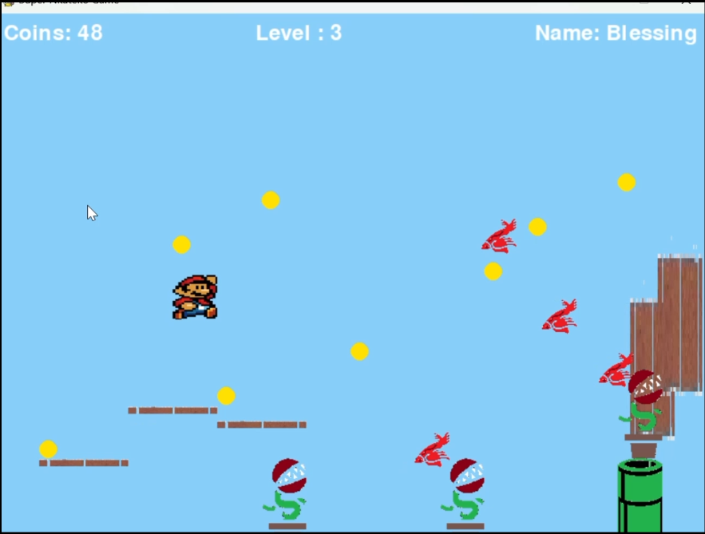

  

<h3 align="center">Super Dupa Game</h3>

---

 Super Dupa Game is my own version of super mario
      

## 📝 Table of Contents

- [About](#about)
- [Getting Started](#pre)
- [Installing](#installing)
- [How to play?](#play)
- [Features](#features)
- [Techonology used](#built_using)
- [Authors](#authors)

## 🧠About 

Welcome to Super Dupa Game! This is a fun, platforming adventure game inspired by classic 2D Mario-style games. The objective is to navigate various levels, collect coins, avoid obstacles, and defeat enemies, all while facing different challenges.

Gameplay Demo in assets/screenshots/super_dupa.mp4

### Prerequisites 

Python 3.x
Pygame library

### 🔧 Installing 

To play Super Dupa Game, you need to have Python and Pygame installed. Follow the instructions below to set it up on your machine.

Requirements
Python 3.x
Pygame library

<h2>Setup Instructions</h2>
 
1. Clone or download this repository to your local machine.
2. Install Pygame by running 
"pip install pygame"
 
3. Run the game using
 
"python main.py"

## 🈠How to play? 
<h3>Game Controls</h3>

- <b>Arrow Keys:</b> Move your character left, right, or up/down.
- <b>Spacebar:</b> Make your character jump.
- <b>P:</b> Pause or resume the game.
- <b>Esc:</b> Quit the game.

<h2>Hint: To finish level 3, zone 2</h2>

- Stand directly next to the warp-pipe on the left(safe zone)
- wait for 20 seconds after the initial start of zone 2
- zone 3 will be automatically loaded on your screen

## 🚀 Features 

- <b>Character Movement:</b> Jump, run, and move left or right as you navigate through levels.
- <b>Enemies:</b> Encounter various enemies that move and interact with the environment.
- <b>Collectibles:</b> Grab coins to increase your score and unlock achievements.
- <b>Pause Feature:</b> Pause the game anytime with the 'P' key to take a break.
- <b>Sound Effects:</b> Enjoy immersive sound effects for jumping, collecting coins, and teleporting.
- <b>Gravity & Jumping:</b> Experience realistic gravity physics and jump mechanics.
- <b>Profile update:</b> On the top you can see the number of coins you, the level you are currently at and your name.

## ⛏️ Built Using 

- Python
- PyGame
- Tkinter

## ✍️ Authors 

- Blessing Hlongwane

